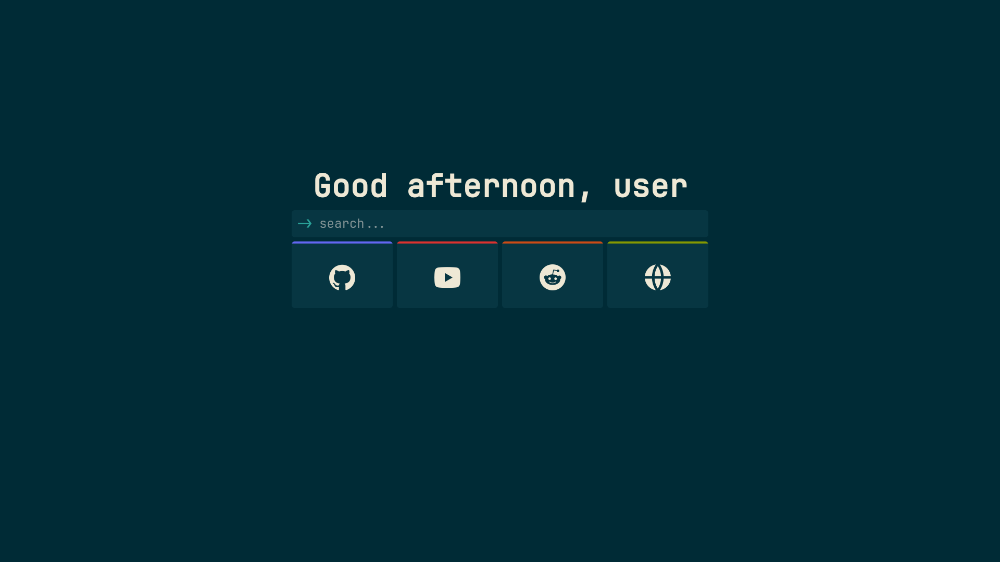

# community-configs

Feel free to contribute by adding any missing colorschemes !

Here is a collection of configs you can try. Just the copy the config and paste it after pressing the import button in the mtab options page.

> [!CAUTION]
> Note that this resets everything, including all the bookmarks, etc. will be the same as depicted in the images.

`neutral` - [config](https://raw.githubusercontent.com/maxhu08/mtab/master/community-configs/configs/neutral.txt)

`catppuccin` - [config](https://raw.githubusercontent.com/maxhu08/mtab/master/community-configs/configs/catppuccin.txt)

`gruvbox` - [config](https://raw.githubusercontent.com/maxhu08/mtab/master/community-configs/configs/gruvbox.txt)

`solarized` - [config](https://raw.githubusercontent.com/maxhu08/mtab/master/community-configs/configs/solarized.txt)

