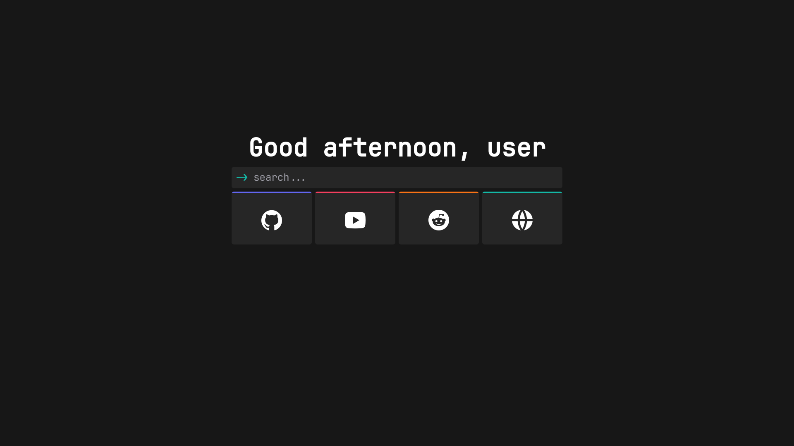
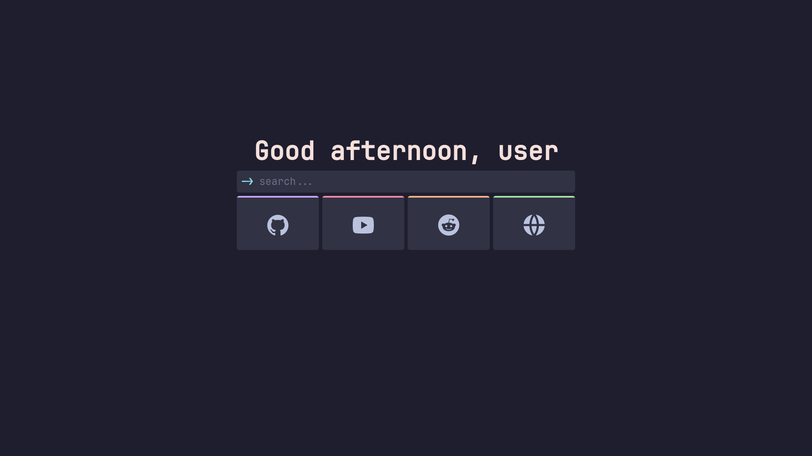
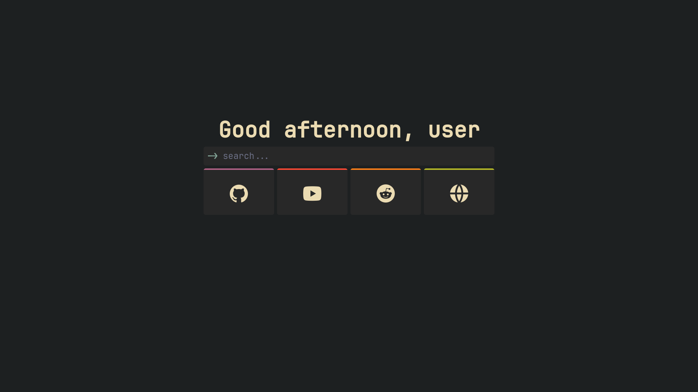

# community-configs

Feel free to contribute by adding any missing colorschemes !

Here is a collection of configs you can try. Just the copy the config and paste it after pressing the import button in the mtab options page.

`neutral` - [config](./community-configs/configs/neutral.txt)

`catppuccin` - [config](./community-configs/configs/catppuccin.txt)

`gruvbox` - [config](./community-configs/configs/gruvbox.txt)

