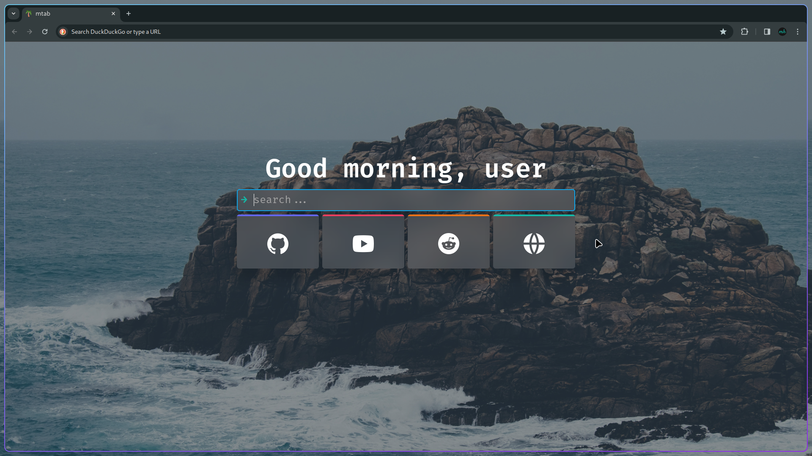
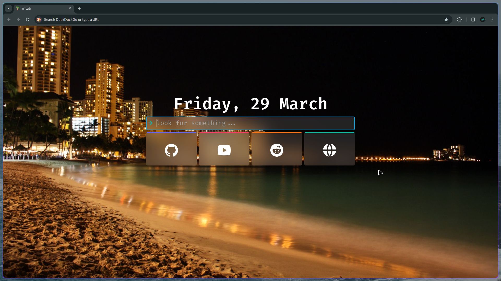
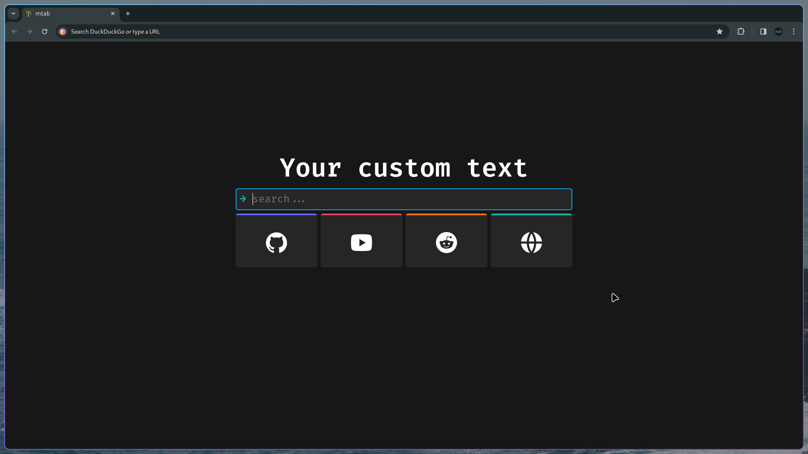
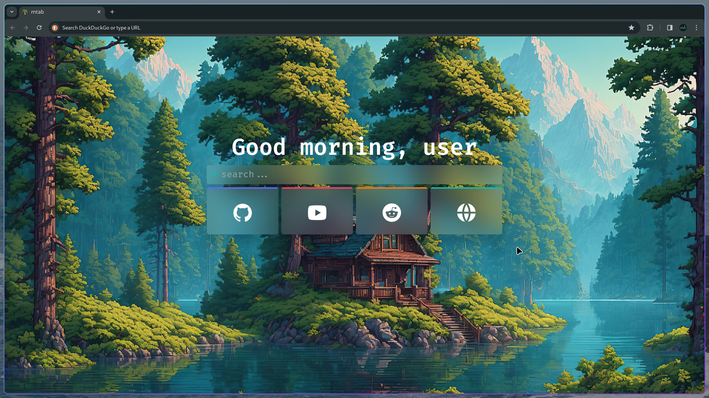
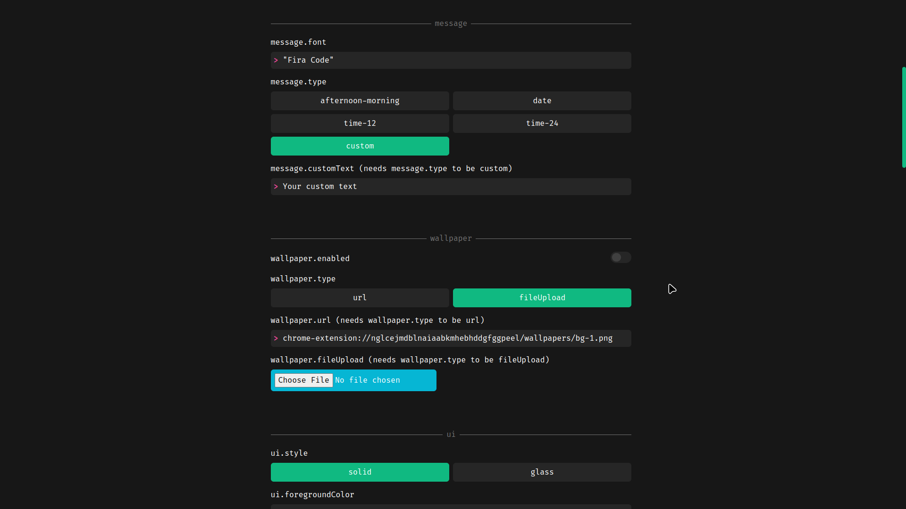

# mtab

a simple configurable new tab extension

## info

mtab is an extension that offers a modern new tab page, prioritizing customizability such as choosing wallpapers, bookmarks, and more. Additionally, it emphasizes a smooth user experience through its animations on the new page.

downloads here:

- [chromium based (chrome, brave)](https://chromewebstore.google.com/detail/mtab/fdaphilojaklgkoocegabckfanjoacjg)
- [firefox](https://addons.mozilla.org/en-US/firefox/addon/mtab)

## features

- upload your own wallpaper
- customize colors
- change font family
- change text
- change search engine
- change animations
- change bookmarks
- hotkeys

## setup

find how to setup here -> https://github.com/maxhu08/mtab/blob/master/SETUP.md
